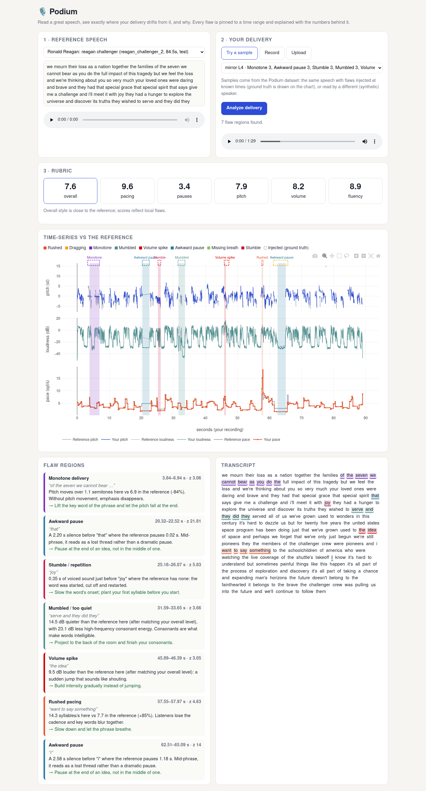
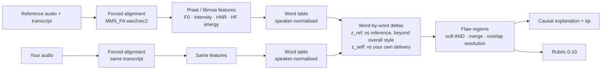

# 🎙️ Podium: contrastive speech delivery analytics with temporal flaw grounding

**Read a great speech. Podium shows exactly where your delivery drifts from it, to the tenth of a second,
and explains each flaw with the numbers behind it.**

Built for the Multimodal AI Hackathon 2026, **Track C: Contrastive Speech Analytics & Temporal Flaw Grounding**.



## What it does

1. **Pick a reference**: an excerpt of a great public-domain speech (JFK, Reagan).
2. **Give your delivery**: record yourself reading the same text in the browser, upload a file, or try one of
   the 207 dataset samples.
3. **Get grounded feedback**:
   - a deterministic **0-10 rubric** for pacing, pauses, pitch, volume and fluency;
   - **flaw regions** with exact start/end times, shaded on time-series overlays of *your* pitch, loudness and
     pace against the reference (time-warped onto your timeline word by word);
   - a **causal explanation** for every region, built from the measured delta ("14.3 syllables/s here vs 7.7 in
     the reference (+85%)") plus a concrete tip;
   - click a flaw to hear it.

Overall style is kept apart from local flaws: a speaker who is a bit slower or flatter than JFK *everywhere* is
told so once ("overall 12% slower"), instead of being flagged on every sentence.

## The dataset: 207 recordings with millisecond labels

No public dataset pairs a good delivery with a spectrum of bad deliveries of the same text, so Podium builds one
([full dataset card](docs/DATASET.md)):

- **6 "ideal" baselines** from three public-domain speeches (JFK's inaugural and Moon speeches, Reagan's
  Challenger address): applause-free excerpts, transcribed with Whisper and force-aligned word by word.
- **The bad mirror**: 8 flaw types (rushed, dragged, monotone, mumbled, volume spike, awkward pause, missing
  breath pause, stutter) injected at 3 severities into the *same audio*, with exact labels:
  - a **gradient** L0 (untouched) → L1 (almost perfect) → L4 (egregious) per baseline,
  - **stress tests**: every flaw type × severity on its own (24 files per baseline).
- **Different speakers**: the same transcripts read by open Piper TTS voices, clean and with flaws, to test that
  the comparison is speaker-agnostic.

Audio download: see **Releases** (`podium-dataset-v1.zip`, FLAC). Labels and transcripts are in
[`data/dataset/`](data/dataset) in this repo.

## How it works



- **Forced alignment** (torchaudio `MMS_FA`) puts both recordings on the same word grid, so word *i* of your
  reading matches word *i* of JFK's.
- **Speaker-agnostic features**: pitch in semitones relative to the speaker's own median F0, loudness in dB
  relative to their median, articulation rate (syllables per second of actual speech), pauses, voiced sound
  inside gaps (restarts), and high-frequency consonant energy (clarity).
- **Two kinds of evidence**: a word is flagged only if it departs from the reference (`z_ref`, robust median/MAD,
  after removing your overall style offset) **and** stands out within your own delivery (`z_self`). That's what
  keeps a different voice from being flagged everywhere: on the held-out different-speaker test it cut false
  alarms on clean recordings from 41/min to about 3/min.
- **Thresholds** are tuned only on the calibration split (JFK) and frozen in
  [`results/thresholds.json`](results/thresholds.json).

## Results (held-out test: Reagan, a different speaker and speech, plus an unseen voice)

Full tables in [`results/evaluation.md`](results/evaluation.md). A detected region counts when its type matches a
labelled flaw with temporal IoU ≥ 0.3.

| | Precision | Recall | F1 | Mean IoU of matches |
|---|---|---|---|---|
| All test recordings | 0.55 | 0.48 | 0.51 | 0.81 |
| Same speaker (bad mirror + stress) | 0.70 | 0.54 | 0.61 | 0.82 |
| Different speaker (TTS reading) | 0.18 | 0.23 | 0.21 | |

- **Temporal precision**: awkward pauses, missing breaths, mumbling and stutters are located with a median
  onset error of **0.00–0.06 s**.
- **The rubric tracks severity**: the overall score falls monotonically from L0 to L4 on every test excerpt
  (Spearman ρ = **−1.00**); measured strength rises with injected severity for pauses (ρ = 0.95) and stutters (0.76).
- **Untouched recordings**: 0 false alarms per minute when you are the reference speaker; 0.87/min across all
  clean test recordings.

**What doesn't work yet, honestly:** pacing flaws are the weakest (F1 0.29–0.35); a dragged phrase is often
reported as an awkward pause, since slowing down stretches the pauses too (see the confusion matrix). And
different-speaker detection is far from solved: a TTS voice's rhythm differs from Reagan's everywhere, which
sets a high noise floor for 0.6-second flaws.

## Run it

```bash
python -m venv .venv && . .venv/bin/activate
pip install -r requirements.txt        # ffmpeg must be installed for browser recordings
# get the audio: unzip podium-dataset-v1.zip from Releases into data/dataset/
python -m uvicorn app.server:app --port 8780
# open http://localhost:8780   (or ?ref=test/reagan_challenger_2&sample=mirror_L4 to jump to a comparison)
```

Everything runs locally; a GPU speeds up alignment but isn't required (it falls back to CPU).

Rebuild and re-evaluate from scratch:

```bash
mkdir -p data/raw data/voices   # the three public-domain .ogg files from Wikimedia Commons, see docs/DATASET.md
python scripts/build_dataset.py # Whisper + forced alignment + flaw injection + Piper voices
python scripts/evaluate.py      # calibrate on JFK, test on Reagan -> results/
```

## Repository

| Path | What |
|---|---|
| `podium/align.py` | forced alignment (MMS_FA) |
| `podium/features.py` | frame and word features, speaker-normalised |
| `podium/flaws.py` | the flaw injector (the "bad mirror") |
| `podium/compare.py` | z_ref / z_self scoring, regions, explanations, rubric |
| `podium/pipeline.py` | end-to-end analysis and plot data |
| `app/` | FastAPI backend + single-page dashboard (Plotly, in-browser recording) |
| `scripts/` | dataset builder and evaluation |
| `docs/` | dataset card, technical report |

## Credits and licences

- Code: MIT.
- Speeches: John F. Kennedy (1961, 1962) and Ronald Reagan (1986), US public domain, via Wikimedia Commons.
- Synthetic voices: [Piper](https://github.com/rhasspy/piper) voices `lessac`, `alan`, `ryan`. Their training data
  licences are non-commercial (Blizzard 2013, CC BY-NC-SA), so the TTS files in the dataset are for
  non-commercial research use.
- Models: Whisper large-v3-turbo (MIT), MMS forced aligner (torchaudio), Praat via Parselmouth, WORLD via pyworld.
